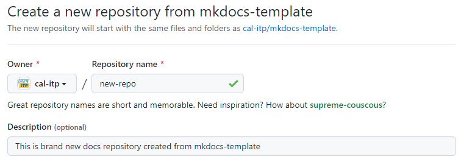

# Getting started

This repository serves as a [GitHub template repository][gh-template-repo] for Cal-ITP.

## Usage

Follow these steps to create a new repository that uses this repository as a template. Adapted from
[GitHub's documentation][gh-template-repo-howto].

1. On GitHub, navigate to the main page of this template repository:  
[`https://github.com/cal-itp/mkdocs-template`](https://github.com/cal-itp/mkdocs-template)

1. Above the file list, click **Use this template**

1. Configure the new repository's details, including the **Owner** (`cal-itp`), **Name**, and **Description**

1. Ensure the new repository's visiblity is set to **Public**

1. Ensure the checkbox to **Include all branches** is checked

1. Click **Create repository from template** to finish and create the new repository

1. _IMPORTANT:_ review the `LICENSE` file and ensure it is appropriate for your new project. If not, update it with a more
appropriate license before continuing.

1. Once the new repository is ready, it's a good idea to Find+Replace instances of `mkdocs-template` within the content
with the name of your new repository. This ensures instructions like [Running locally](./running-locally.md) continue to work
in the new project.

[gh-template-repo]: https://docs.github.com/en/github/creating-cloning-and-archiving-repositories/creating-a-repository-on-github/creating-a-repository-from-a-template
[gh-template-repo-howto]: https://docs.github.com/en/github/creating-cloning-and-archiving-repositories/creating-a-repository-on-github/creating-a-repository-from-a-template#creating-a-repository-from-a-template

